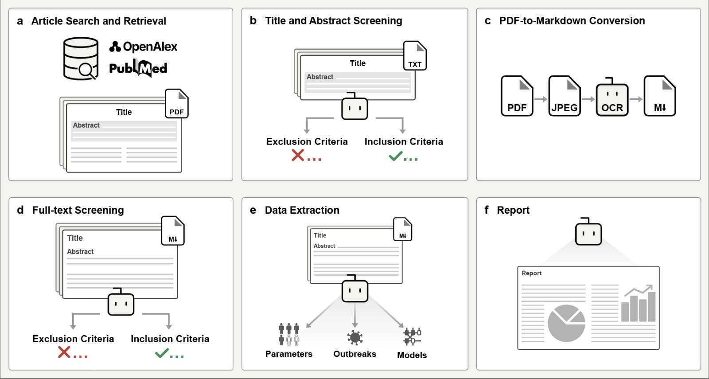

# AgentSLR: Automating Systematic Literature Reviews in Epidemiology with Agentic AI

<table style="border-collapse: separate; border-spacing: 20px 0;">
  <tr>
    <td align="center" style="padding: 4px 8px;">
      <a href="https://arxiv.org/abs/2603.22327">
         <strong>Paper</strong>
      </a>
    </td>
    <td align="center" style="padding: 4px 8px;">
      <a href="https://huggingface.co/datasets/OxRML/AgentSLR">
         <strong>Dataset</strong>
      </a>
    </td>
    <td align="center" style="padding: 4px 8px;">
      <a href="https://oxrml.com/agent-slr/">
         <strong>Project Website</strong>
      </a>
    </td>
  </tr>
</table>

AgentSLR is an open-source pipeline for conducting end-to-end systematic literature reviews in epidemiology. It brings together article retrieval, title and abstract screening, PDF-to-Markdown OCR conversion, full-text screening, structured extraction and report generation in one modular codebase.

> Systematic literature reviews are essential for synthesising scientific evidence but are costly, difficult to scale and time-intensive, creating bottlenecks for evidence-based policy. We study whether large language models can automate the complete systematic review workflow, from article retrieval, article screening, data extraction to report synthesis. Applied to epidemiological reviews of nine WHO-designated priority pathogens and validated against expert-curated ground truth, our open-source agentic pipeline (AgentSLR) achieves performance comparable to human researchers while reducing review time from approximately 7 weeks to 20 hours (a 58x speed-up). Our comparison of five frontier models reveals that performance on SLR is driven less by model size or inference cost than by each model's distinctive capabilities. Through human-in-the-loop validation, we identify key failure modes. Our results demonstrate that agentic AI can substantially accelerate scientific evidence synthesis in specialised domains.

<p align="center">
  
</p>
<p align="center">
  <em>AgentSLR automates the review flow from search and retrieval to report (living review) generation.</em>
</p>

## Repository Overview


| Directory | Purpose | Documentation |
|-----------|---------|---------------|
| [`src/harvest/`](src/harvest/) | Metadata retrieval and PDF download | [README](src/harvest/README.md) |
| [`src/screening/`](src/screening/) | Abstract and full-text screening | [README](src/screening/README.md) |
| [`src/ocr/`](src/ocr/) | PDF-to-Markdown conversion | [README](src/ocr/README.md) |
| [`src/extraction/`](src/extraction/) | Structured data extraction | [README](src/extraction/README.md) |
| [`src/analysis/`](src/analysis/) | Report generation | [README](src/analysis/README.md) |
| [`scripts/`](scripts/) | Shell wrappers for all stages | See subdirectory READMEs |
| [`eval/`](eval/) | Evaluation against PERG ground truth | [README](eval/README.md) |
| [`notebooks/`](notebooks/) | Paper figures and statistics | [README](notebooks/README.md) |

[`main.py`](main.py) is the single CLI entrypoint for the pipeline.
It is set to work with nine WHO (World Health Organization) priority pathogens including  Marburg, Ebola, Lassa, SARS, Zika, MERS, Nipah, Rift Valley fever and Crimean-Congo haemorrhagic fever.

## Data Workspace

The scripts allow for configurable directories to store model artefacts and results across each stage. Due to the critical nature of epidemiology data, and the hundreds of thousands of articles processed per review, we store outputs for each stage of the pipeline, as these are often required to meet reporting standards.


Assuming `data/agentslr` is set as the main output directory, the directory structure would look like the tree below. The structure is simple: harvest artefacts live once per pathogen, while LLM-specific outputs live under `client/<client_dir_name>/...` so different reasoning models can be compared against the same corpus.

```text
data/
├── agentslr/
│   ├── harvests/
│   │   └── <pathogen>/
│   │       ├── harvest_metadata.csv
│   │       ├── harvest_downloaded_pdfs.csv
│   │       ├── articles_with_markdown.csv
│   │       ├── pdfs/
│   │       └── ocr/
│   │           └── <ocr_client>/
│   │               └── markdown/
│   └── client/
│       └── <client_dir_name>/
│           └── <pathogen>/
│               ├── screening/
│               │   ├── abstract_screening.csv
│               │   └── fulltext_screening.csv
│               ├── extractions/
│               │   ├── data_extraction_parameters.jsonl
│               │   ├── data_extraction_models.csv
│               │   └── data_extraction_outbreaks.csv
│               ├── report/
│               └── logs/
└── perg/
    ├── screening/
    └── extracted/
```

`client_dir_name` is either inferred from `--model-name` or set explicitly with `--client-dir-name`.

## Environment Setup

### Base environment

```bash
python3 -m venv .venv
source .venv/bin/activate
pip install --upgrade pip
pip install -r requirements.txt
```

Use this environment for harvest, screening, extraction, evaluation and report generation.

**Note:** This environment can be used for OCR as well, if using Mistral API.

### OCR environment

If you want to run local OCR backends such as GLM or Paddle, create a dedicated OCR environment:

```bash
python3 -m venv .venv-ocr
source .venv-ocr/bin/activate
pip install --upgrade pip

# Install a torch build that matches your machine first
pip install torch

# Install exactly one Paddle runtime
# CPU example:
pip install paddlepaddle

# GPU example:
# pip install paddlepaddle-gpu

pip install -r requirements-ocr.txt
```

### API keys and config

You can pass credentials directly on the command line or store them in `config.json`:

```json
{
  "openai_api_key": "your-openai-api-key",
  "openrouter_api_key": "your-openrouter-api-key",
  "mistral_api_key": "your-mistral-api-key"
}
```

Useful environment variables:

```bash
export OPENAI_API_KEY="..." # Optional if using local hosted model
export OPENALEX_API_KEY="..." # Optional
export NCBI_API_KEY="..." # Optional
export NCBI_EMAIL="you@example.com" # Optional
export UNPAYWALL_EMAIL="you@example.com" # Optional
export MISTRAL_API_KEY="..." # Optional if using local hosted model
```

## Running AgentSLR

### Quickstart
Run the full pipeline:

```bash
scripts/pipeline/run_all_stages.sh \
  <pathogen> <data-dir> <model-name> <client-dir-name> \
  --base-url <api-endpoint> \
  --api-key <api-key> \
  --ocr-client mistral \
  --config-json config.json
# e.g. lassa data/agentslr gpt-oss-120b gpt_oss_120b --base-url http://localhost:1738/v1
```

Run individual stages:

```bash
python main.py \
  --stage <stage> \
  --pathogen <pathogen> \
  --data-dir <data-dir> \
  --model-name <model-name> \
  --client-dir-name <client-dir-name>
```

### Detailed Usage Arguments


The recommended entrypoints are the shell wrappers in [`scripts/`](scripts/). They cover all stages.

> ⚠️ The pipeline defaults are currently tuned for reasoning-capable models and OpenAI-compatible backends that accept arguments such as `reasoning_effort`, `reasoning`, and in some cases provider-specific `extra_body` fields. If you use a model or server that does not support these arguments, you may encounter request failures such as connection issues or `400` errors.


See [`scripts/`](scripts/) subdir

The key `main.py` arguments for pipeline runs are:

| Argument | Required? | What to pass | Why it matters |
| --- | --- | --- | --- |
| `--stage` | Yes | A stage from the table above, most often `run_all`. | Selects which pipeline block to run. |
| `--pathogen` | Yes | One of `marburg`, `ebola`, `lassa`, `sars`, `zika`, `nipah`, `rvf`, `cchf`, `mers`. | Chooses the review topic and query set. |
| `--data-dir` | Optional | A workspace root such as `data/agentslr`. | Controls where harvests, screening outputs, extractions and reports are written. |
| `--model-name` | Recommended | The reasoning model name, for example `openai/gpt-oss-120b` | Determines the client/model used for screening and extraction stages. |
| `--client-dir-name` | Recommended | A stable short label such as `gpt_oss_120b`. | Keeps outputs for different reasoning models separated under `client/<client_dir_name>/...`. |
| `--base-url` | Optional | API endpoint such as `http://localhost:6767/v1`, `https://api.openai.com/v1` or `https://openrouter.ai/api/v1`. | Needed when using OpenAI-compatible hosted or local servers. |
| `--api-key` | Optional | Matching API key, often `6767` for local vLLM. | Authenticates requests to the configured client endpoint. |
| `--config-json` | Optional | Usually `config.json`. | Loads saved API keys such as OpenAI, OpenRouter or Mistral credentials. |
| `--resume-from` | Optional | A later stage such as `ocr`, `fulltext_screen` or `write_up_parameters`. | Only used with `--stage run_all`; resumes the pipeline from that stage onward. |
| `--ocr-client` | Optional | `mistral`, `glm` or `paddle`. | Selects the OCR backend for the OCR stage inside `run_all` or standalone `ocr`. |
| `--ocr-python-bin` | Optional | Usually `.venv-ocr/bin/python`. | Lets `run_all` switch just the OCR stage into the dedicated OCR environment. |
| `--report-model-name` | Optional | A report model such as `openai/gpt-oss-120b`. | Lets write-up refinement use a different model from screening/extraction. |


The arguments that can be passed through `--stage` determine, which functionality of the review pipeline is run. The options are:

| Stage | What it does | Typical use |
| --- | --- | --- |
| `harvest` | Fetches metadata, deduplicates results and downloads PDFs. | Start a new review corpus. |
| `run_all` | Runs the full pipeline in order: harvest, abstract screening, OCR, full-text screening, extraction and write-up. | Standard end-to-end run. |
| `abstract_screen` | Screens titles and abstracts using the configured reasoning model. | Re-run abstract inclusion/exclusion without repeating harvest. |
| `ocr` | Converts PDFs into Markdown using `mistral`, `glm` or `paddle`. | Prepare article text for full-text screening and downstream extraction. |
| `fulltext_screen` | Screens the OCR Markdown at the full-text stage. | Re-run full-text inclusion/exclusion after OCR or prompt/model changes. |
| `data_extraction` | Alias for the first extraction stage. Maps to `data_extraction_parameters`. | Resume from the extraction block with a shorter stage name. |
| `data_extraction_parameters` | Extracts epidemiological parameter data. | Parameter-focused extraction runs. |
| `data_extraction_models` | Extracts transmission and modelling-study information. | Model-study extraction runs. |
| `data_extraction_outbreaks` | Extracts outbreak-event information. | Outbreak-focused extraction runs. |
| `write_up` | Alias for the first write-up stage. Maps to `write_up_parameters`. | Resume from the reporting block with a shorter stage name. |
| `write_up_parameters` | Generates the parameter report. | Parameter report generation. |
| `write_up_models` | Generates the modelling report. | Model report generation. |
| `write_up_outbreaks` | Generates the outbreak report. | Outbreak report generation. |

`--stage run_all` runs the full end-to-end sequence. If you also pass `--resume-from <stage>`, it starts from that stage and continues through the rest of the pipeline.


## Running With OpenRouter Or Local vLLM

The screening, extraction and report stages all use the same OpenAI-compatible client interface. In practice that means you can point AgentSLR at OpenAI, OpenRouter or a local vLLM server by changing `--base-url`, `--api-key` and `--model-name`.

### OpenRouter

```bash
python main.py \
  --stage fulltext_screen \
  --pathogen lassa \
  --data-dir data/agentslr \
  --model-name openai/gpt-oss-120b \
  --client-dir-name gpt_oss \
  --base-url https://openrouter.ai/api/v1 \
  --config-json config.json \
  --fulltext-screening-mode direct_fulltext
```

### Local vLLM

Serve a local model:

```bash
scripts/serve_vllm/serve_client.sh
```

The helper defaults to port `6767`, API key `6767`, model `openai/gpt-oss-20b`, GPU IDs `0`, tensor parallel size `1`, `--max-model-len 131072`, and `--async-scheduling`. You can override them with optional args such as `--port`, `--api-key`, `--model-name`, `--gpu-ids`, `--tp-size`, and repeated `--extra-vllm-arg`.


You can also run the equivalent command directly:

```bash
vllm serve openai/gpt-oss-120b \
  --port 6767 \
  --api-key 6767 \
  --tensor-parallel-size 2 \
  --max-model-len 131072 \
  --async-scheduling
```

Then point AgentSLR at it:

```bash
scripts/pipeline/run_all_stages.sh \
  lassa data/agentslr openai/gpt-oss-120b gpt_oss_120b \
  --base-url http://localhost:6767/v1 \
  --api-key 6767
```

Additional recipe-style serving notes for DeepSeek, Kimi and GLM are in [`scripts/serve_vllm/README.md`](scripts/serve_vllm/README.md).

## Evaluation

```bash
python -m eval.run_eval <evaluation> \
  --pathogen <Pathogen> \
  --screened <path-to-results> \
  --output-dir <output-dir>
```

See [`eval/README.md`](eval/README.md) for full evaluation documentation.

## Citation

If you use AgentSLR, please cite:

```bibtex
@misc{padarha2025agentslr,
  title={AgentSLR: Automating Systematic Literature Reviews
         in Epidemiology with Agentic AI},
  author={Padarha, Shreyansh and Kearns, Ryan Othniel
          and Naidoo, Tristan and Yang, Lingyi
          and Borchmann, {\L}ukasz and B{\l}aszczyk, Piotr
          and Morgenstern, Christian and McCabe, Ruth
          and Bhatia, Sangeeta and Torr, Philip H.
          and Foerster, Jakob and Hale, Scott A.
          and Rawson, Thomas and Cori, Anne
          and Semenova, Elizaveta and Mahdi, Adam},
  year={2026},
  eprint={2603.22327},
  archivePrefix={arXiv},
  primaryClass={cs.IR},
  url={https://arxiv.org/abs/2603.22327}
}
```